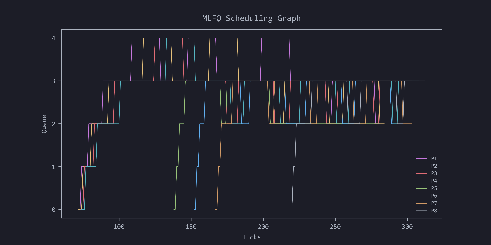

## Modified xv6-riscv (OSN Assignment 4)

Submitted by:
- [Vanshpreet Singh Kohli, 2020114014](https://github.com/VKohli17)
- [Rahul Garg, 2020115006](https://github.com/VanSHOE)

Note: to run with a specific scheduler (FCFS, LBS, PBS, MLFQ, RR) instead of the default (RR), use the following command:

```bash
make qemu SCHEDULER="STRING"
```

where `STRING` is one of the following:
- `FCFS` (First Come First Serve)
- `LBS` (Lottery Based Scheduler)
- `PBS` (Priority Based Scheduler)
- `MLFQ` (Multi Level Feedback Queue)
- `RR` (Round Robin)

### Specification 1: System Calls

#### System Call 1: `trace`

This can be used to trace all the system calls made by a process with the accompanying user program `strace`. 
<br>

#### System Call 2: `sigalarm`, `sigreturn`

We add a new  `sigalarm(interval, handler)`  system call. If an application calls  `alarm(n, fn)` , then after every `n` "ticks" of CPU time that the program consumes, the kernel will cause application function  `fn`  to be called. When  `fn`  returns, the
application will resume where it left off.

We also add another system call `sigreturn()` , to reset the process state to before the `handler` was called. This system call needs to be made at the end of the handler so the process can resume where it left off.

### Specification 2: Scheduling

#### a. First Come First Serve (FCFS)

First, we disable preemption by calling `yield()` only for preemptive schedulers, instead of calling it by default . We also define `createTime` for each process, which is the time at which the process was created. We then sort the processes in the `runqueue` by their `createTime` and run them in that order.
<br>

#### b. Lottery Based Scheduler (LBS)

We generate a random number lesser than the total number of tickets with runnable processes. We then oop through the processes and subtract the number of tickets from the random number until the random number is less than 0. The process that was currently being looped over, is the winner. We then the process that is the winner, and release the locks for the other processes.
<br>

#### c. Priority Based Scheduler (PBS)

For priority based scheduling, we loop through the processes to find the one with the highest dynamic priority, using the number of times the process has been scheduled (`timesScheduled`) and the time it was created (`createTime`) as tiebreakers for setting higher priorities. We then run the process with the highest priority.
<br>

#### d. Multi-Level Feedback Queue (MLFQ)

For each scheduling round, an aging function is run over all the processes in all but the topmost queue. The aging limits (measured in time spent waiting in the queue) were set empirically after manual testing over test workload. The processes in all but the bottom-most queue that are found to have spent the stipulated amount of time running (in ticks) in their respective queues, meanwhile, are demoted to a lower queue. The queues 0, 1, 2, 3 and 4 are checked seriatim for runnable processes – if a process is found in a higher queue while another lower process is running, the latter is pre-empted to allow the former to run. The processes in the bottom-most queue are run in a Round Robin fashion.
<br>

#### Comparison of Schedulers

| Scheduler | Average Runtime | Average Wait time |
| --- | --- | --- |
| FCFS | 11 | 104 |
| RR | 9 | 107 |
| PBS | 11 | 104 |
| LBS | 9 | 107 |
| MLFQ | 9 | 135 |


### Specification 3: Copy-on-Write fork

In xv6 the `fork` system call creates a duplicate process of the parent process and also copies the memory content of the parent process into the child process. This results in inefficient usage of memory since the child may only read from memory. The idea behind a copy-on-write is that when a parent process creates a child process then both of these processes initially will share the same pages in memory and these shared pages will be marked as copy-on-write which means that if any of these processes will try to modify the shared pages then only a copy of these pages will be created and the modifications will be done on the copy of pages by that process and thus not affecting the other process.
<br>

### MLFQ Scheduling Analysis

To get the data for the scheduling analysis, procdump (^P) was used following some modifications while running xv6 with the MLFQ scheduler enabled. The output from the terminal was then saved to a csv, the contents of which were used to make a simple plot using matplotlib in python. Here is the required graph showing processes in each queue over time:

<br>



*This repository is a fork of [MIT's xv6-riscv](https://github.com/mit-pdos/xv6-riscv). The Original README, the contents of which have been omitted here, can be found there.*
